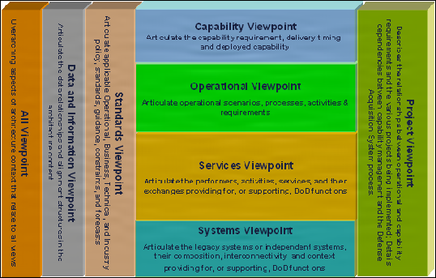
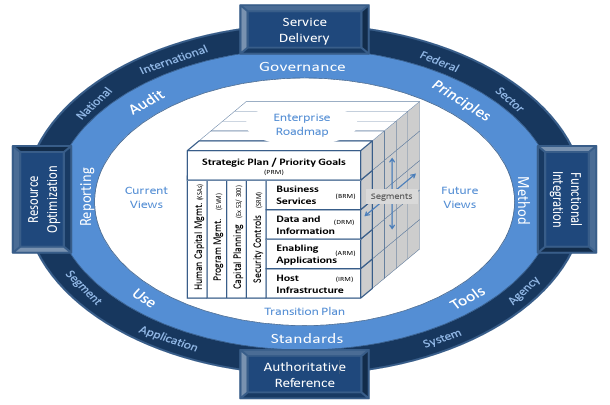

# Enterprise Architecture Reference Frameworks

- [Enterprise Architecture Reference Frameworks](#enterprise-architecture-reference-frameworks)
  - [MODAF - British Ministry of Defense Architecture Framework (UK)](#modaf---british-ministry-of-defense-architecture-framework-uk)
  - [DoDAF - Department of Defense Architecture Framework (US)](#dodaf---department-of-defense-architecture-framework-us)
  - [FEAF - Federal Enterprise Architecture Framework](#feaf---federal-enterprise-architecture-framework)
  - [TOGAF - The Open Group Architecture Framework](#togaf---the-open-group-architecture-framework)
  - [Zachman Enterprise Architecture Framework](#zachman-enterprise-architecture-framework)
  - [The $EA^3$ Cube Approach](#the-ea3-cube-approach)

## MODAF - British Ministry of Defense Architecture Framework (UK)

## DoDAF - Department of Defense Architecture Framework (US)

URL: https://dodcio.defense.gov/library/dod-architecture-framework/

The detail framework 2.02 is here: https://dodcio.defense.gov/DODAF/

DoDAF Meta Model: https://dodcio.defense.gov/Library/DoD-Architecture-Framework/dodaf20_dm2/

Based on DoD Architeture Framework Version 2.02, here is the viewpoint:

The DoDAF Meta Model (DM2) defines three levels:

| DM2 Level | Name | Full Name | Content | Schema Files | Definitions and Aliases | Description Documents |
| --- | --- | --- | --- | --- | --- | --- |
| DIV-1 | CDM | Conceptual Data Model | Concepts and concept relationships | N/A | | Conceptual Data Model (CDM) Description, Manager and Core Process Stakeholder's Guide to DM2 |
| DIV-2 | LDM | Logical Data Model | Reified and Formailized Relationships | UML and XMI files employing IDEAS Profile | MS Excel file | Logical Data Model (LDM) Description, Architect's Guide |
| DIV-3 | PES | Physical Exchange Schema | XML encoding of LDM | XML Schema Description (XSD) | | Physical Exchange Specification (PES), Integrator, Data Analyst, and Developer's Guide |

## FEAF - Federal Enterprise Architecture Framework

FEAF - Federal Enterprise Architecture Framework - is developed by the Federal Government of the United States and is the industry standard for government enterprise architecture frameworks.

It's archived here https://obamawhitehouse.archives.gov/omb/e-gov/fea till 2013.

The Consolidated Reference Model (CRM) of the FEAF equips OMB (Office of Management and Budget) and Federal agencies with a common language and framework to describe and analyze investments. It contains a set of interrelated "reference models" designed to facilitate cross-agency analysis and the identification of duplicative investments, gaps and opportunities for collaboration within and across agencies.

| RM | RM-FullName | Description | Content | Artefacts |
| --- | --- | --- | --- | --- |
| PRM | Performance Reference Model | links agency strategy, internal business components, and investments, providing a means to measure the impact of those investments on strategic outcomes. | - Cross-Agency and Inter-Agency Goals and Objectives - Uniquely tailored performance indicators | - Goals - Meas. Area - Meas. Category |
| BRM | Business Reference Model | describes an organization through a taxonomy of common mission and support service areas instead of through a stove-piped organizational view, thereby promoting inter- and inter-agency collaboration. | - Intra- and inter-agency shared services - Agencies, customers, partners, providers. | - Mission Sector - Business Function - Service |
| DRM | Data Reference Model | facilitates discovery of existing data holdings residing in "silos" and enables understanding the meaning of the data, how to access it, and how to leverage it to support performance results. | - Business-focused data standardization - Cross-agency information exchanges | - Domain - Subject - Topic |
| ARM | Application Reference Model | categorizes the system- and application-related standards and technologies that support the delivery of service capabilities, allowing agencies to share and reuse common solutions and benefit from economies of scale. | - Software providing functionality - Enterprise service bus | - System - Application Component - Interface |
| IRM | Infrastructure Reference Model | categorizes the network/cloud related standards and technologies to support and enable the delivery of voice, data, video, and mobile service components and capabilities. | - Hardware providing functionality - Hosting, data centers, cloud, virtualization | - Platform - Network - Facility |
| SRM | Security Reference Model | provides a common language and methodology for discussing security and privacy in the context of federal agencies' business and performance goals. | - Risk-adjusted security/privacy protection - Security control design / implementation | - Purpose  - Risk - Control |

Consolidated Reference Model Relationship Diagram is as below:

## TOGAF - The Open Group Architecture Framework

## Zachman Enterprise Architecture Framework

## The $EA^3$ Cube Approach

Enterprise Architecture = Strategy + Business + Technology

(EA = S + B + T)

- [EA3 Cube Approach - Whitepaper](../ref/ea3/ea3-cube-approach.pdf)
- [EA3: A Primer](../ref/ea3/EA3-A-Primer.pdf)