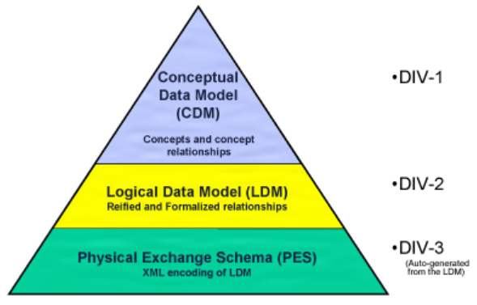
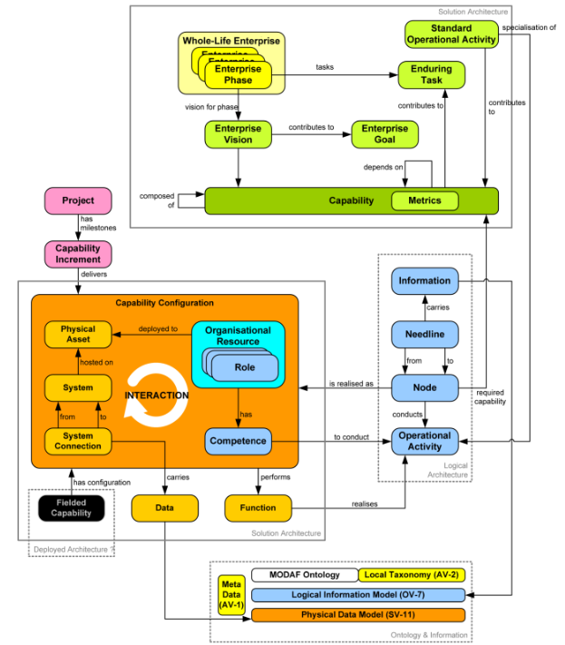
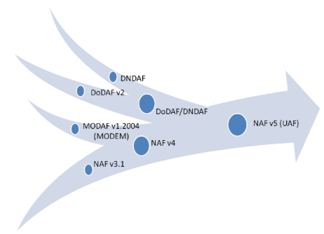
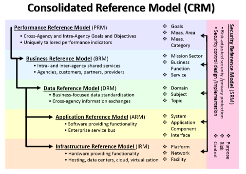
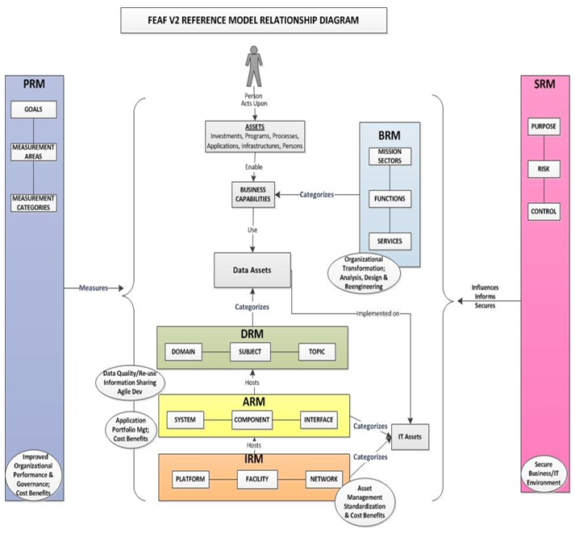
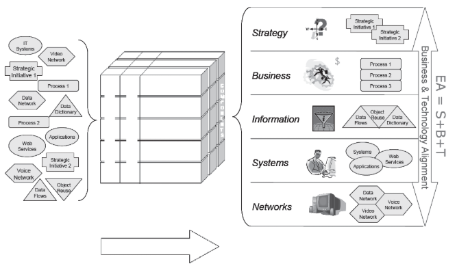

# Enterprise Architecture Reference Frameworks

- [Enterprise Architecture Reference Frameworks](#enterprise-architecture-reference-frameworks)
  - [DoDAF - Department of Defense Architecture Framework (US)](#dodaf---department-of-defense-architecture-framework-us)
  - [MODAF - British Ministry of Defense Architecture Framework (UK)](#modaf---british-ministry-of-defense-architecture-framework-uk)
  - [NAF V4](#naf-v4)
  - [FEAF - Federal Enterprise Architecture Framework](#feaf---federal-enterprise-architecture-framework)
  - [TOGAF - The Open Group Architecture Framework](#togaf---the-open-group-architecture-framework)
  - [Zachman Enterprise Architecture Framework](#zachman-enterprise-architecture-framework)
  - [The $EA^3$ Cube Approach](#the-ea3-cube-approach)

## DoDAF - Department of Defense Architecture Framework (US)

URL: https://dodcio.defense.gov/library/dod-architecture-framework/

The detail framework 2.02 is here: https://dodcio.defense.gov/DODAF/

DoDAF Meta Model: https://dodcio.defense.gov/Library/DoD-Architecture-Framework/dodaf20_dm2/

Based on DoD Architeture Framework Version 2.02, here is the viewpoint:

The DoDAF Meta Model (DM2) defines three levels:

| DM2 Level | Name | Full Name | Content | Schema Files | Definitions and Aliases | Description Documents |
| --- | --- | --- | --- | --- | --- | --- |
| DIV-1 | CDM | Conceptual Data Model | Concepts and concept relationships | N/A | | Conceptual Data Model (CDM) Description, Manager and Core Process Stakeholder's Guide to DM2 |
| DIV-2 | LDM | Logical Data Model | Reified and Formailized Relationships | UML and XMI files employing IDEAS Profile | MS Excel file | Logical Data Model (LDM) Description, Architect's Guide |
| DIV-3 | PES | Physical Exchange Schema | XML encoding of LDM | XML Schema Description (XSD) | | Physical Exchange Specification (PES), Integrator, Data Analyst, and Developer's Guide |

## MODAF - British Ministry of Defense Architecture Framework (UK)

MODAF - The MOD Architecture Framework - is a set of rules that support UK Government's defense planning and change management activities.

URL: https://www.gov.uk/guidance/mod-architecture-framework

The guidance was withdrawn on 15 January 2021, it had been replaced with the NATO Architecture Framework (NAF) V4.

The simplified overview of the MODAF Meta Model (M3) is here:

As the framework had been withdrawn, here are the MODAF documents downloaded from above website and list for reference (and archiving):

MODAF Guidance:
- [MODAF Meta Model (M3): an introduction](../ref/modaf/20090310_modaf_meta_model_v1_0-U_-_withdrawn.pdf)

Viewpoints and Views:
- Views Summary Documents:
  - [MODAF View Summary](../ref/modaf/20090216ViewsummaryU_withdrawn.pdf)
  - [MODAF Layers and Viewpoint Linkages](../ref/modaf/20090219_MODAF_Layers_and_Viewpoint_Linkages_U-withdrawn.pdf)
  - [StV2 OV2 OV5 SV1 SV4U Views Pictures](../ref/modaf/20091126StV2_OV2_OV5_SV1_SV4U-withdrawn.png)
  - [Views Home Downloadable](../ref/modaf/ViewsHomeDownloadable-withdrawn.pdf)
- All Views ViewPoint: [AV Viewpoint](../ref/modaf/20100426MODAFAVViewpoint1_2_004U.pdf)
- Strategic View Viewpoint: [StV Viewpoint](../ref/modaf/20100426MODAFStVViewpoint1_2_004U-withdrawn.pdf)
- Operational View Viewpoint:
  - [OV Viewpoint](../ref/modaf/20100426MODAFOVViewpoint1_2_004U__1_withdrawn.pdf)
  - [IERs in MODAF](../ref/modaf/IERsinMODAF__1_wthdrawn.pdf)
- System View Viewpoint: [SV Viewpoint](../ref/modaf/20100426MODAFSVViewpointV1_2_004U-withdrawn.pdf)
- Technical Standards View Viewpoint: [TV Viewpoint](../ref/modaf/20100426MODAFTVViewpointV1_2_004U-Withdrawn.pdf)
- Acquisition View Viewpoint: [AcV Viewpoint](../ref/modaf/20100426MODAFAcVViewpointV1_2_004U-withdrawn.pdf)
- Service Oriented View Viewpoint: [SOV Viewpoint](../ref/modaf/20100426MODAFSOVViewpointV1_2_004U-withdrawn.pdf)

MODAF Meta Model and MODAF Ontological Data Exchange Mechanism:
- [MODAF Meta Model 3](../ref/modaf/20130117_MODAF_M3_version1_2_004_withdrawn.pdf)
- MODAF Ontological Data Exchange Mechanism: [MODAF MODEM](../ref/modaf/20130117_MODAF_MODEM-withdrawn.pdf)

Use and Examples of MODAF:
- Uses and Examples:
  - [The MODAF Architecturing Process](../ref/modaf/20090210_MODAF_Architecting_Process_V1_0_U-withdrawn.pdf)
  - [MODAF Support to Analysis of Capability Integration in the Context of Defense Lines of Development (DLODs)](../ref/modaf/20090210_MODAFDLODAnalysis_V1_0_U-withdrawn.pdf)
  - [MODAF Support to User Requirements Definition](../ref/modaf/20090210_MODAFSupporttoURDs_V1_0_U-withdrawn.pdf)
  - [MODAF Support to System Requirements Definition](../ref/modaf/20090210_MODAFSupporttoSRDs_V1_0_U-withdrawn.pdf)
  - [MODAF Support to Dependency Analysis](../ref/modaf/20090210_MODAFSupporttoDependencyAnalysisV1_0_U-withdrawn.pdf)
  - [MODAF Support to Gap Analysis](../ref/modaf/20090210_MODAF_Support_to_Gap_Analysis_V1_0_U-withdrawn.pdf)
  - [Creating Capability Architectures with MODAF](../ref/modaf/20090217_CreatingCapabilityArchitectures_V1_0_U-withdrawn.pdf)

Frequently Asked Questions:
- [Ontologies and Their Use in MODAF](../ref/modaf/20090203_Ontologies_and_their_Use_MODAF_V1_0_U-withdrawn.pdf)
- [MODAF Glossary](../ref/modaf/20090304_MODAF01_2Glossary_V1_0__1-withdrawn.pdf)
- [Comparison of MODAF with Other Frameworks](../ref/modaf/20090521_MODAF_1_2_FAQs_Comparison_Of_MODAF_With_Other_Frameworks_V1_0_U-withdrawn.pdf)
- [How MODAF can Reflect Security Concerns](../ref/modaf/20090521_MODAF_1_2_FAQs_How_MODAF_Can_Reflect_Security_Concerns_V1_0_U-withdrawn.pdf)
- [Unified Modeling Language (UML) Relation to MODAF](../ref/modaf/20090520_MODAF_1_2FAQs_UML_Relation_To_MODAF_V1_0_U-withdrawn.pdf)
- [Coherency across Models with MODAF](../ref/modaf/20090520_MODAF_1_2_FAQs_Coherency_Across_ModelsWithMODAF_V1_0_U-withdrawn.pdf)
- [Sharing Architecture Data](../ref/modaf/20090520_MODAF1_2_FAQs_Sharing_Architecture_Data_V1_0_U.pdf)
- [Other Frequently Asked Questions](../ref/modaf/20081023_MODAF_FAQs_V1_0_U-withdrawn.pdf)

Other MODAF Reference:
- [MODAF Website Download V1.2 004](../ref/modaf/20100602MODAFDownload12004.pdf)
- [MODAF 1.2 Version History V1.0](../ref/modaf/20090518_MODAF_1_2_Version_History_V1_0_U-withdrawn.pdf)
- [MODAF 1.2 004 Change Log](../ref/modaf/20100426MODAF1_2_004ChangeLog-withdrawn.pdf)

## NAF V4

URL: https://www.nato.int/en/about-us/organization/nato-structure/digital-policy-committee-dpc/nato-architecture-framework-version

Current version is V4.1 as of March 2026.

You can find the downloaded documents here: [NAF V4.1](../ref/naf/)

NAFv4_Meta-Model can be found here: https://nafdocs.github.io/modem/

Below shows the NATO's roadmap to Unified Architecture Framework:

## FEAF - Federal Enterprise Architecture Framework

FEAF - Federal Enterprise Architecture Framework - is developed by the Federal Government of the United States and is the industry standard for government enterprise architecture frameworks.

It's archived here https://obamawhitehouse.archives.gov/omb/e-gov/fea till 2013.

The Consolidated Reference Model (CRM) of the FEAF equips OMB (Office of Management and Budget) and Federal agencies with a common language and framework to describe and analyze investments. It contains a set of interrelated "reference models" designed to facilitate cross-agency analysis and the identification of duplicative investments, gaps and opportunities for collaboration within and across agencies.

| RM | RM-FullName | Description | Content | Artefacts |
| --- | --- | --- | --- | --- |
| PRM | Performance Reference Model | links agency strategy, internal business components, and investments, providing a means to measure the impact of those investments on strategic outcomes. | - Cross-Agency and Inter-Agency Goals and Objectives - Uniquely tailored performance indicators | - Goals - Meas. Area - Meas. Category |
| BRM | Business Reference Model | describes an organization through a taxonomy of common mission and support service areas instead of through a stove-piped organizational view, thereby promoting inter- and inter-agency collaboration. | - Intra- and inter-agency shared services - Agencies, customers, partners, providers. | - Mission Sector - Business Function - Service |
| DRM | Data Reference Model | facilitates discovery of existing data holdings residing in "silos" and enables understanding the meaning of the data, how to access it, and how to leverage it to support performance results. | - Business-focused data standardization - Cross-agency information exchanges | - Domain - Subject - Topic |
| ARM | Application Reference Model | categorizes the system- and application-related standards and technologies that support the delivery of service capabilities, allowing agencies to share and reuse common solutions and benefit from economies of scale. | - Software providing functionality - Enterprise service bus | - System - Application Component - Interface |
| IRM | Infrastructure Reference Model | categorizes the network/cloud related standards and technologies to support and enable the delivery of voice, data, video, and mobile service components and capabilities. | - Hardware providing functionality - Hosting, data centers, cloud, virtualization | - Platform - Network - Facility |
| SRM | Security Reference Model | provides a common language and methodology for discussing security and privacy in the context of federal agencies' business and performance goals. | - Risk-adjusted security/privacy protection - Security control design / implementation | - Purpose  - Risk - Control |

Consolidated Reference Model Relationship Diagram is as below:

## TOGAF - The Open Group Architecture Framework

## Zachman Enterprise Architecture Framework

## The $EA^3$ Cube Approach

Enterprise Architecture = Strategy + Business + Technology

(EA = S + B + T)

- [EA3 Cube Approach - Whitepaper](../ref/ea3/ea3-cube-approach.pdf)
- [EA3: A Primer](../ref/ea3/EA3-A-Primer.pdf)