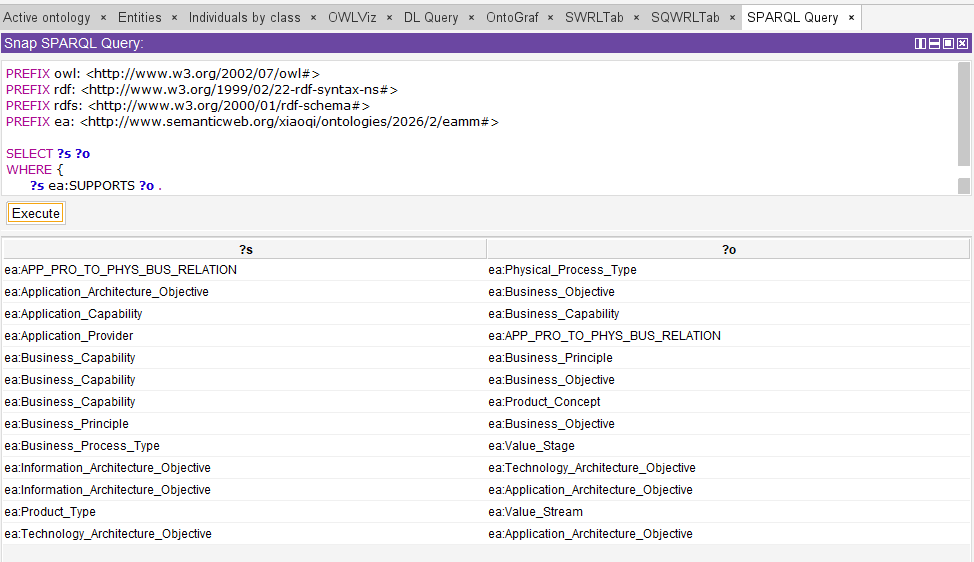

# Query Ontology (RDF) Using SPARQL

- [Query Ontology (RDF) Using SPARQL](#query-ontology-rdf-using-sparql)
  - [Preparation for PREFIX](#preparation-for-prefix)
  - [Query Specific Relationship between Classes](#query-specific-relationship-between-classes)

## Preparation for PREFIX

```sql
PREFIX owl: <http://www.w3.org/2002/07/owl#>
PREFIX rdf: <http://www.w3.org/1999/02/22-rdf-syntax-ns#>
PREFIX rdfs: <http://www.w3.org/2000/01/rdf-schema#>
PREFIX ea: <http://www.semanticweb.org/xiaoqi/ontologies/2026/2/eamm#>
```

## Query Specific Relationship between Classes

Example: Relation "SUPPORTS"

```sql
PREFIX owl: <http://www.w3.org/2002/07/owl#>
PREFIX rdf: <http://www.w3.org/1999/02/22-rdf-syntax-ns#>
PREFIX rdfs: <http://www.w3.org/2000/01/rdf-schema#>
PREFIX ea: <http://www.semanticweb.org/xiaoqi/ontologies/2026/2/eamm#>

SELECT ?s ?p ?o
WHERE {?s ea:SUPPORTS ?o}
```



Note: in Protege's `Snap SPARQL` plug-in, it's disallowed to use `?p` inside `WHERE` clause, due to following two reasons:

1. Reasoning Overhead (Computational Complexity)
In Description Logic, if you allow the predicate (the relationship) to be a variable ?p, the reasoner (e.g., HermiT or Pellet) must iterate through every possible Object Property, Data Property, and Annotation Property defined in your ontology to see which ones satisfy the triple.

    - The Risk: For a complex model like your EA Meta-Model, this creates a "computational explosion."

    - The Result: It would likely cause Protege to freeze or crash because the underlying logic-based search is far more taxing than a simple text-based database search.

2. Plugin Intent: "DL-Safe" Queries
Snap SPARQL was designed to execute DL-safe queries. This means it maps SPARQL syntax directly onto OWL concept searching.

    - The OWL Core: The heart of OWL is the relationship between Class —> Property —> Class.

    - The Constraint: To keep the math behind the reasoning "decidable" (meaning the computer can actually finish the calculation), the plugin requires the relationship (the predicate) to be a known, explicit entity. It cannot "guess" the relationship using a variable.